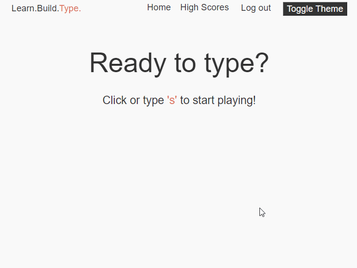

<h1 align="center">LearnBuildType ✍</h1>

    

---
## What is game?
>📌 Type the correct key game and get into the TOP 10 leadership table
---
## Where can i play?

If the badge below 👇 says **Sucess** you can play it here 👉 [**react-and-serverless.netlify.app**](https://react-and-serverless.netlify.app)

---
## What is this repo about?

This repo contains the project that i created in the [React and Serverless - Fullstack Web Development course](https://www.udemy.com/course/react-and-serverless/) by James Quick.

It was super fun to build this project and James is an excellent instructor. I didn't know too much about the technologies (see below) he used for making the project and i'm be sure i will make use of them in future projects

---
## Tech Stack for this project

\

\
Credits for the badges to this awesome repo 👉 [Badges 4 README.md Profile](https://github.com/alexandresanlim/Badges4-README.md-Profile)

>There were no Auth0 badges :c

---
## My socials 👋 say hi

    
    
    

